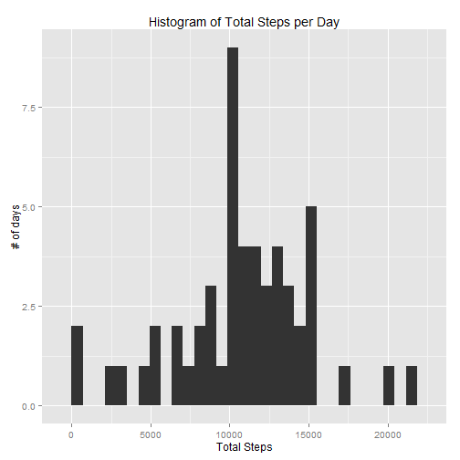
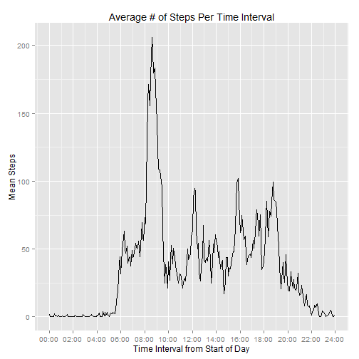
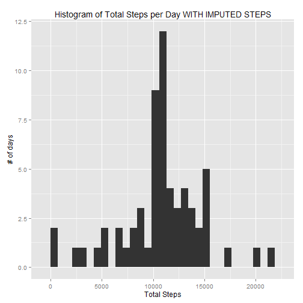
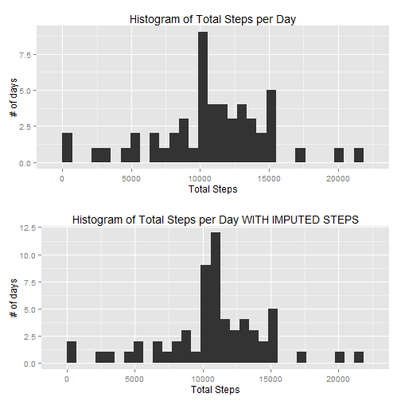
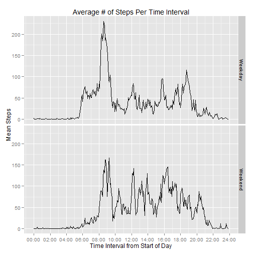

Reproducible Research -- Peer Assessment #1 Project
========================================================

Submitted by Mort Goldman

## Loading and preprocessing the data


```r
#convert date column to R date as part of initial read
setClass('ymdDate')
setAs("character","ymdDate", function(from) as.Date(from, format="%Y-%m-%d"))

# and do the read
activity <- read.csv("activity.csv", colClasses=c('numeric', 'ymdDate', 'numeric'))
summary(activity)
```

```
##      steps            date               interval   
##  Min.   :  0.0   Min.   :2012-10-01   Min.   :   0  
##  1st Qu.:  0.0   1st Qu.:2012-10-16   1st Qu.: 589  
##  Median :  0.0   Median :2012-10-31   Median :1178  
##  Mean   : 37.4   Mean   :2012-10-31   Mean   :1178  
##  3rd Qu.: 12.0   3rd Qu.:2012-11-15   3rd Qu.:1766  
##  Max.   :806.0   Max.   :2012-11-30   Max.   :2355  
##  NA's   :2304
```

```r
str(activity)
```

```
## 'data.frame':	17568 obs. of  3 variables:
##  $ steps   : num  NA NA NA NA NA NA NA NA NA NA ...
##  $ date    : Date, format: "2012-10-01" "2012-10-01" ...
##  $ interval: num  0 5 10 15 20 25 30 35 40 45 ...
```

```r
### intervals are 5 minute segments of the day saved in the format:
#  0,5,10,15,20,25,30,35,40,45,50,55,100,105,110, ...
#  this format is a tad funky as it creates gaps from 55 to 100, 155 to 200, etc.
#  let's instead calculate minutes from start of day to make this a truly "interval" variable
activity$intervalMins <- 
        (floor(activity$interval / 100) * 60) + (activity$interval %% 100)

### add a few utility conversion functions for intervals
timeIntervalFromMinsInDay    <- function(mins) {((mins %/% 60) * 100) + (mins %% 60) }
timeIntervalFromMinsAsString <- 
  function(mins) {sprintf("%02d:%02d",(mins %/% 60), (mins %% 60))} 
```
**1. What is mean total number of steps taken per day?**

Per instructions, for this part of the assignment, ignore the missing values in the dataset.

First calculate aggregate steps per day
  note this can be done in many ways (aggregate, tapply, plyr, etc.) 
  this time let's use SQL -- note where clause skips the NAs:

```r
library(sqldf)
```

```
## Loading required package: gsubfn
## Loading required package: proto
## Loading required package: RSQLite
## Loading required package: DBI
## Loading required package: RSQLite.extfuns
```

```r
totalStepsPerDay <- sqldf("select date,sum(steps) as steps
                      from activity 
                      where steps is not null 
                      group by date 
                      order by date")
```

```
## Loading required package: tcltk
```

```r
summary(totalStepsPerDay)
```

```
##       date                steps      
##  Min.   :2012-10-02   Min.   :   41  
##  1st Qu.:2012-10-16   1st Qu.: 8841  
##  Median :2012-10-29   Median :10765  
##  Mean   :2012-10-30   Mean   :10766  
##  3rd Qu.:2012-11-16   3rd Qu.:13294  
##  Max.   :2012-11-29   Max.   :21194
```
**1. Make a histogram of the total number of steps taken each day**

```r
library("ggplot2")

## Note I tested different bin sizes and ended up sticking with default of 30 bins
## The appearance is quite different as you vary bin size.

widthBin <- (max(totalStepsPerDay$steps)-min(totalStepsPerDay$steps))/30

a1 <- ggplot(totalStepsPerDay, aes(x=steps)) + 
           geom_histogram(binwidth=widthBin) + 
           ggtitle("Histogram of Total Steps per Day") +
           ylab("# of days") +
           xlab("Total Steps")
a1
```

 
  
**2. Calculate and report the mean and median total number of steps taken per day**

```r
mean(totalStepsPerDay$steps)
```

```
## [1] 10766
```

```r
median(totalStepsPerDay$steps)
```

```
## [1] 10765
```
## What is the average daily activity pattern?

**1. Make a time series plot (i.e. type = "l") of the 5-minute interval (x-axis) and the average number of steps taken, averaged across all days (y-axis)**

```r
avgStepsPerInterval <- sqldf("select intervalMins,avg(steps) as steps
                      from activity 
                      where steps is not null 
                      group by intervalMins 
                      order by intervalMins")

## show time interval axis tick every two hours (120 minutes)
timeIntervalBreaks <- seq(from = 0, to = (60*24), by = 120)

b1 <- ggplot(avgStepsPerInterval, aes(x=intervalMins, y=steps)) + 
  geom_line() + 
  ggtitle("Average # of Steps Per Time Interval") +
  ylab("Mean Steps") +
  xlab("Time Interval from Start of Day") +
  scale_x_continuous(breaks = timeIntervalBreaks, 
                     labels = sprintf("%02d:%02d",
                                      timeIntervalBreaks %/% 60, 
                                      timeIntervalBreaks %% 60))
b1
```

 
  
**2. Which 5-minute interval, on average across all the days in the dataset, 
contains the maximum number of steps?**

```r
timeIntervalFromMinsAsString(
       avgStepsPerInterval[avgStepsPerInterval$steps == 
                                               max(avgStepsPerInterval$steps),]$intervalMins) 
```

```
## [1] "08:35"
```
## Imputing missing values
Note that there are a number of days/intervals where there are missing values (coded as NA). 
The presence of missing days may introduce bias into some calculations or summaries of the data.
  
**1. Calculate and report the total number of missing values in the dataset 
(i.e. the total number of rows with NAs)**

```r
nrow(activity) - nrow(na.omit(activity)) 
```

```
## [1] 2304
```

  and which columns hold NAs?
  

```r
for (i in colnames(activity)){
  message(paste('Number of missing values in column ',i,': ',sum(is.na(activity[,i]))))
}
```

```
## Number of missing values in column  steps :  2304
## Number of missing values in column  date :  0
## Number of missing values in column  interval :  0
## Number of missing values in column  intervalMins :  0
```
  
Note that the missing values are all in the steps column.  
  
**2. Devise a strategy for filling in all of the missing values in the dataset.**
  
The strategy does not need to be sophisticated. For example, you could use the mean/median 
for that day, or the mean for that 5-minute interval, etc.

*What we want to impute are the number of steps -- we could use a more sophisticated approach such as basing the imputed values on k- nearest neighbors, but for this assignment I will stick with the suggestion and use the time of day interval.*
  
**3. Create a new dataset that is equal to the original dataset but with the missing data filled in.**
  
As only steps has NAs let's impute values for steps using average steps per time interval as default

```r
imputedActivity <- sqldf("select a.steps, a.date, a.intervalMins, i.steps as meanSteps
       from activity a, avgStepsPerInterval i
       where a.intervalMins = i.intervalMins")

# replace the NAs with the mean for that interval
imputedActivity$steps[is.na(imputedActivity$steps)] <- 
  imputedActivity$meanSteps[is.na(imputedActivity$steps)]
summary(imputedActivity)
```

```
##      steps            date             intervalMins    meanSteps     
##  Min.   :  0.0   Min.   :2012-10-01   Min.   :   0   Min.   :  0.00  
##  1st Qu.:  0.0   1st Qu.:2012-10-16   1st Qu.: 359   1st Qu.:  2.49  
##  Median :  0.0   Median :2012-10-31   Median : 718   Median : 34.11  
##  Mean   : 37.4   Mean   :2012-10-31   Mean   : 718   Mean   : 37.38  
##  3rd Qu.: 27.0   3rd Qu.:2012-11-15   3rd Qu.:1076   3rd Qu.: 52.83  
##  Max.   :806.0   Max.   :2012-11-30   Max.   :1435   Max.   :206.17
```

```r
totalStepsPerDayWithImpute <- sqldf("select date,sum(steps) as steps
                      from imputedActivity 
                      group by date 
                      order by date")
summary(totalStepsPerDayWithImpute)
```

```
##       date                steps      
##  Min.   :2012-10-01   Min.   :   41  
##  1st Qu.:2012-10-16   1st Qu.: 9819  
##  Median :2012-10-31   Median :10766  
##  Mean   :2012-10-31   Mean   :10766  
##  3rd Qu.:2012-11-15   3rd Qu.:12811  
##  Max.   :2012-11-30   Max.   :21194
```
  
**4. Make a histogram of the total number of steps taken each day and Calculate and report the mean and median total number of steps taken per day.** 

```r
widthBin <- (max(totalStepsPerDayWithImpute$steps)-min(totalStepsPerDayWithImpute$steps))/30

c1 <- ggplot(totalStepsPerDayWithImpute, aes(x=steps)) + 
  geom_histogram(binwidth=widthBin) + 
  ggtitle("Histogram of Total Steps per Day WITH IMPUTED STEPS") +
  ylab("# of days") +
  xlab("Total Steps")
c1
```

 

```r
# note I am using a utility I found to place multiple ggplots
source("multiplot.R")
multiplot(a1,c1)
```

```
## Loading required package: grid
```

 
  

```r
#  Calculate and report the mean and median total number of steps taken per day
mean(totalStepsPerDayWithImpute$steps)
```

```
## [1] 10766
```

```r
median(totalStepsPerDayWithImpute$steps)
```

```
## [1] 10766
```
**Do these values differ from the estimates from the first part of the assignment?  What is the impact of imputing missing data on the estimates of the total daily number of steps?**
  
*Based on the approach for imputing values that I took, there is no significat impact on the median or mean number of steps per day.  Looking at the histograms, one can see that there are additional days that are now at the median.  This is not surprsing -- and I think algeraically obvious -- if you impute the median value then you're "reinforcing" the median.*      
  
## Are there differences in activity patterns between weekdays and weekends?
  
For this part the weekdays() function may be of some help here. 
Use the dataset with the filled-in missing values for this part.

**1. Create a new factor variable in the dataset with two levels - "weekday" and "weekend" indicating whether a given date is a weekday or weekend day.**

```r
weekend <- c("Saturday","Sunday")
imputedActivity$dayOfWeek <- weekdays(imputedActivity$date)
imputedActivity$weekend <- imputedActivity$dayOfWeek %in% weekend
imputedActivity$partOfWeek <- factor(imputedActivity$weekend,labels=c("Weekday","Weekend"))
```
**2. Make a panel plot containing a time series plot (i.e. type = "l") of the 5-minute interval (x-axis) and the average number of steps taken, # averaged across all weekday days or weekend days (y-axis). The plot should look something like the following, which was creating using simulated data:**

```r
avgStepsPerIntervalWithImputeByWeekPart <- 
               sqldf("select intervalMins, partOfWeek, avg(steps) as steps
                      from imputedActivity 
                      group by intervalMins, partOfWeek 
                      order by intervalMins")

## show time interval axis tick every two hours (120 minutes)
timeIntervalBreaks <- seq(from = 0, to = (60*24), by = 120)

d1 <- ggplot(avgStepsPerIntervalWithImputeByWeekPart, aes(x=intervalMins, y=steps)) + 
  geom_line() +
  facet_grid(partOfWeek ~ .) +
  ggtitle("Average # of Steps Per Time Interval") +
  ylab("Mean Steps") +
  xlab("Time Interval from Start of Day") +
  scale_x_continuous(breaks = timeIntervalBreaks, 
                     labels = sprintf("%02d:%02d",
                                      timeIntervalBreaks %/% 60, 
                                      timeIntervalBreaks %% 60))
d1
```

 
